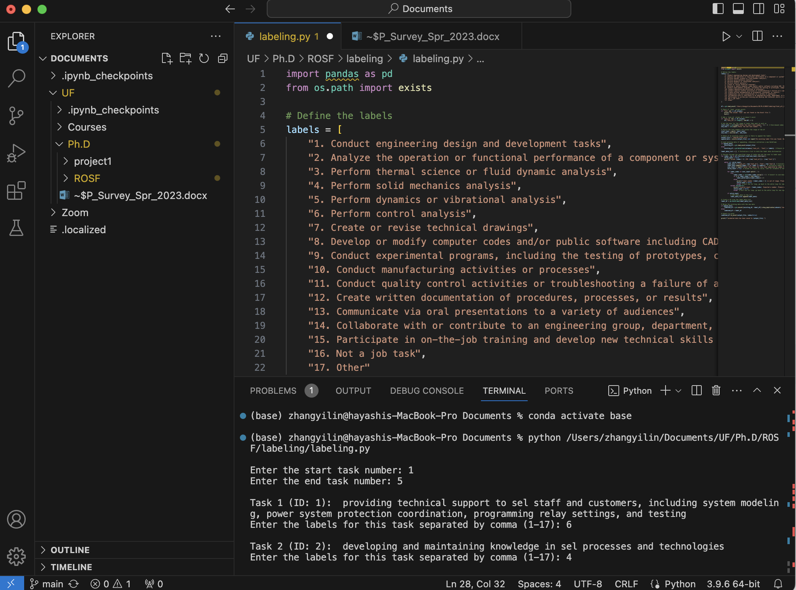

<h1 align="center">
  <br/>ROSF_labeling
</h1>


<div align="center">
  <a href="#Environment Configuration"><b>Environment Configuration</b></a> |
  <a href="#Code"><b>Code</b></a> |
  
  
</div>

<br/>

## Environment Configuration

1. Download [Visual Studio Code](https://code.visualstudio.com/) Or Log in [UF App](https://login.apps.ufl.edu/logon/LogonPoint/tmindex.html)
2. Install [Anaconda](https://www.anaconda.com/download) : Python interpreter is located in the Anaconda3 environment. Anaconda is a Python distribution that can create virtual environments and contains many libraries for scientific computing and data analysis.）
3. Excel file exists : Make sure the 'final_all_tasks.xlsx' file is in the same directory as your Python script, or that you have provided the correct file path. If the file is not in the same directory, provide an absolute or relative path to the file to ensure the script can find it.

## In Visual Studio Code

1. Open your labeling.py file in VScode

2. Make sure to replace the "final_all_tasks.xlsx" path with the path where the file is stored on your computer
   
<div align="center">
  
</div>

3. Install Package
   
    Install the pandas package in TERMINAL. Now, you can install pandas by running the following command:
```bash
conda install pandas
```
4. Run your code
   
   Run your code in TERMINAL. Now, you can running the following command:
```bash
python (The path where the "final_all_tasks.xlsx" file is stored locally on your computer)
```
5. Start Labeling
   
   Select the start and end tasks, and select the appropriate description from the 17 categories to start labeling.
   
   Enter the start task number:
   
   Enter the end task number: 

<div align="center">
  
</div>


## Thank you

