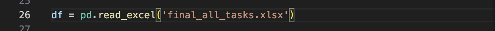

<h1 align="center">
  <br/>ROSF_labeling
</h1>


<div align="center">
  <a href="#Environment Configuration"><b>Environment Configuration</b></a> |
  <a href="#features"><b>Features</b></a> |
  <a href="#requirements"><b>Requirements</b></a> |
  <a href="#installation"><b>Installation</b></a> |
  <a href="#usage"><b>Usage</b></a>
  
</div>

<br/>

## Environment Configuration

1. Download [Visual Studio Code](https://code.visualstudio.com/) Or Log in [UF App](https://login.apps.ufl.edu/logon/LogonPoint/tmindex.html)
2. Install [Anaconda](https://www.continuum.io/downloads) （Python interpreter is located in the Anaconda3 environment. Anaconda is a Python distribution that can create virtual environments and contains many libraries for scientific computing and data analysis.）
3. Activate the Anaconda environment
   
 Before running your script, first activate the Anaconda environment to ensure that your script is running in the correct environment. An Anaconda environment can be activated using the following command:
```bash
conda activate base

```
4. Install Package

 Install the pandas package. Now, you can install pandas by running the following command:
```bash
conda install pandas
```

Excel file exists: Make sure the 'final_all_tasks.xlsx' file is in the same directory as your Python script, or that you have provided the correct file path. If the file is not in the same directory, provide an absolute or relative path to the file to ensure the script can find it.

Make sure to replace the "final_all_tasks.xlsx" path with the path where the file is stored on your computer

<div align="center">
  
</div>

