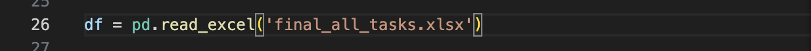
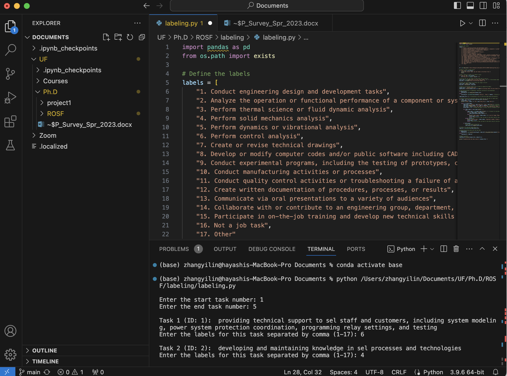

<h1 align="center">
  <br/>ROSF_labeling
</h1>


<div align="center">
  <a href="#Environment Configuration"><b>Environment Configuration</b></a> |
  <a href="#Code"><b>Code</b></a> 
  
  
</div>

<br/>

## Environment Configuration

- Download [Visual Studio Code](https://code.visualstudio.com/) Or Log in [UF App](https://login.apps.ufl.edu/logon/LogonPoint/tmindex.html)
- Install [Anaconda](https://www.anaconda.com/download) : Anaconda is a Python distribution that can create virtual environments and contains many libraries for scientific computing and data analysis.
<!-- 3. Excel file exists : Make sure the 'final_all_tasks.xlsx' file is in the same directory as your Python script, or that you have provided the correct file path. If the file is not in the same directory, provide an absolute or relative path to the file to ensure the script can find it. -->

## Label job task using `labeling.py`

- Open your `labeling.py` file in VScode

- Provided the correct absolute file path where `final_all_tasks.xlsx` is stored on your computer.

Replace `/Users/zhangyilin/Documents/UF/Ph.D/ROSF/labeling/final_all_tasks.xlsx` with the correct absolute file path where `final_all_tasks.xlsx` is stored on your computer in `line 26` to ensure the script can find it. 
   
<div align="center">
  
</div>

- Install `pandas` Package
   
You can install pandas by running the following command in `Terminal`:
```bash
conda install pandas
```
- Run `labeling.py`
   
You can running the following command in `Terminal`:
```bash
python (The path where the "labeling.py" file is stored locally on your computer)
```
- Start Labeling
   
Select the start and end tasks, and select the appropriate description from the `17` categories to start labeling.

<div align="center">
  
</div>


